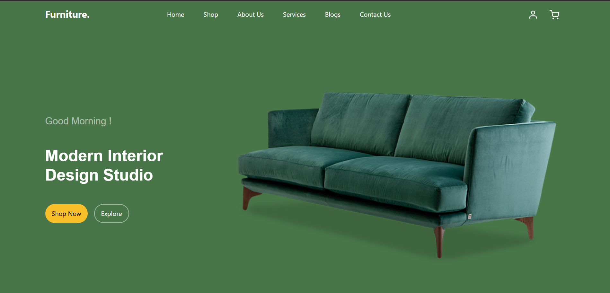

# 🪑 Frontend Project for The Furniture Shop Website

A responsive and visually appealing website created for a **Furniture Shop**, showcasing products and essential information to potential customers.  
This project demonstrates the use of **HTML**, **CSS**, **JavaScript**, and the **Bootstrap** framework for building modern, user-friendly interfaces.
🔗 **[View Live Demo](https://eligentfurniture.netlify.app/)**   

  
*Landing page of The FurnitureShop website.*

---

## 📖 Description

The **FurnitureShop Website** is a **frontend project** developed to represent a furniture store’s digital presence.  
It is fully responsive and designed to provide a smooth browsing experience across all devices.

### ✨ Key Features:
- 🏠 Elegant, user-friendly homepage with a product showcase  
- 📱 Fully responsive layout using **Bootstrap grid system**  
- 🎨 Clean and modern UI design with smooth transitions and animations   
- 📞 Contact section with company information and inquiry form   
- 🔗 Multiple hyperlinks for internal navigation and external resources  

---

## 🧰 Tech Stack

| Technology | Purpose |
|-------------|----------|
| **HTML5** | Structure and layout of the web pages |
| **CSS3** | Styling and visual design |
| **JavaScript** | Interactivity and dynamic features |
| **Bootstrap 5** | Responsive design and UI components |

---

## 🚀 How to Run Locally

1. **Clone the repository**
   ```bash
   git clone https://github.com/your-username/FurnitureShop.git

2. **Navigate to the Project Folder**
   ```bash
   cd FurnitureShop
   
3. **Open index.html in your browser**
